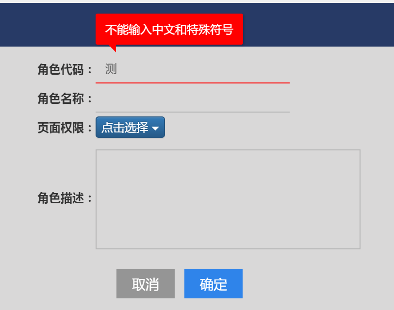
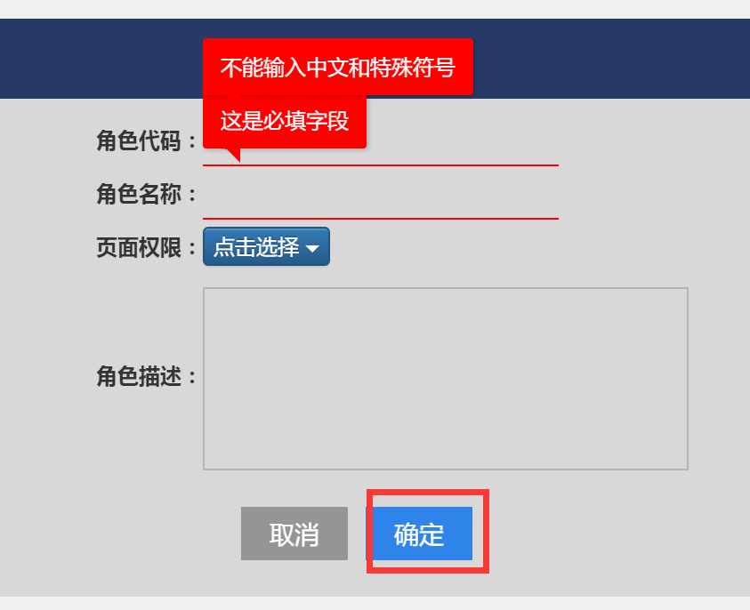

# 用于表单验证
# 安装
* `bower install check-form-tips`
* `angular.module('app', ['check-form-tips'])`
* 校验配置使用angular原生的表单校验方式  如`required`,`ng-pattern`等
# 使用
* `msg-options` 用于自定义提示消息
* `<input name='code'/>` name属性是必须的,用于确定唯一的表单元素
```html
<div>
    <form novalidate name="saveForm">
        <table my-form="saveForm" check-tips-home
               check-form="checkForm"
               submited="saveFormSubmited">
            <tr>
                <td><label>CODE：</label></td>
                <td>
                    <input type="text"
                           check-layer-tips
                           ng-maxlength="20"
                           ng-pattern="/^[A-Za-z\d-.]+$/"
                           msg-options="{pattern:'不能输入中文和特殊符号',required:'自定义不能为空的提示'}"
                           required
                           name="code"
                           ng-model="pageData.form.code">
                </td>
            </tr>
            <tr>
                <td><label>名称：</label></td>
                <td><input type="text"
                           check-layer-tips
                           ng-maxlength="20"
                           required
                           name="name"
                           ng-model="pageData.form.name"></td>
            </tr>
        </table>
    </form>
    <div>
        <button class="sure" ng-click="save()">提交</button>
    </div>
</div>
```
```js
        $scope.save = function () {

            //表单校验
            if (!$scope.saveForm.$valid) {
                //提示失败
                
                //防止未修改值时表单校验失败
                $scope.saveFormSubmited = true;
                
                //触发所有表单校验
                $scope.checkForm = !$scope.checkForm;
                return;
            }

            //执行提交
            //ajax...

        };
```
# 效果


